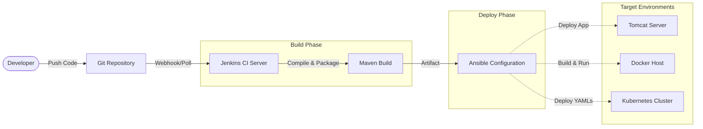

# Jenkins Ansible Kubernetes CI/CD

     

---

**A comprehensive collection of Implementation documents** to build, configure, and automate a full-fledged robust DevOps CI/CD Pipeline from scratch.

This repository is designed to provide step-by-step guidance, configurations, and deployment strategies utilizing industry-standard tools including **Git, Jenkins, Maven, Ansible, Docker, and Kubernetes**.

## Use Case
This repository acts as a centralized knowledge base and implementation guide for setting up end-to-end continuous integration and continuous deployment (CI/CD) pipelines. It is ideal for teams or individuals looking to configure automation servers (Jenkins), integrate build tools (Maven), manage configuration (Ansible), and deploy applications seamlessly to containerized environments (Docker) and container orchestration platforms (Kubernetes).

## Architecture



## Tech Stack
- **Version Control:** Git
- **Continuous Integration:** Jenkins
- **Build Tool:** Apache Maven
- **Configuration Management:** Ansible
- **Containerization:** Docker
- **Orchestration:** Kubernetes
- **Web Server / App Server:** Apache Tomcat

## Project Structure
```text
.
├── Ansible/            # Ansible installation and setup notes
├── Docker/             # Docker installation, commands, and Dockerfiles
├── Jenkins/            # Jenkins installation, Git, and Maven integrations
├── Jenkins_Jobs/       # CI/CD Jenkins job templates and deployment guides
├── Kubernetes/         # K8s setup, deployment YAMLs, and Ansible/Jenkins integration
├── Tomcat/             # Apache Tomcat server installation steps
└── README.md           # Project documentation
```

## Key Workflows & Features
- **Jenkins CI Automation:** From fundamental Jenkins installations to plugin integrations (Git, Maven) and running automated maven builds.
- **Ansible Configuration Management:** Setting up Ansible on RHEL and integrating it with Jenkins for streamlined, agentless deployment tasks.
- **Containerization with Docker:** Dockerfile creation for custom images (Apache, Application specific), managing containers, and interacting with DockerHub.
- **Kubernetes Orchestration:** Step-by-step Kubernetes cluster setup, composing deployment and service YAML files (`valaxy-deploy.yml`, `valaxy-service.yml`), and orchestrating Jenkins-Ansible-K8s workflows.
- **Automated Deployments:** Ready-to-use playbooks and documentation for deploying applications directly to Tomcat servers or as containers in Docker/Kubernetes.

## Getting Started

1. **Clone the Repository:**
   ```bash
   git clone https://github.com/mpandey95/jenkins-ansible-kubernetes-cicd.git
   cd jenkins-ansible-kubernetes-cicd
   ```

2. **Explore the Modules:**
   Navigate through specific module folders based on your requirement:
   - For Jenkins CI setup, view the `Jenkins/` directory.
   - For writing automation playbooks, refer to the `Jenkins_Jobs/` and `Ansible/` guides.
   - For containerizing workloads, refer to the `Docker/` directory and progress to the `Kubernetes/` directory for orchestration.

3. **Follow Implementation Sub-Guides:**
   Inside each module, refer to the provided `.MD` files and templates in sequential order.

---

**Manish Pandey** — Senior DevOps/Platform Engineer

### 🛠️ Technology Stack
#### ☁️ Cloud & Platforms


#### ⚙️ Platform & DevOps


#### 🔐 Security & Ops


#### 🧑‍💻 Programming


#### 💾 Database


### Connect With Me
- **GitHub:** [@mpandey95](https://github.com/mpandey95)
- **LinkedIn:** [manish-pandey95](https://linkedin.com/in/manish-pandey95)
- **Email:** <mnshkmrpnd@gmail.com>

### License
See **LICENSE** | Support: [GitHub](https://github.com/mpandey95) • [LinkedIn](https://linkedin.com/in/manish-pandey95)
